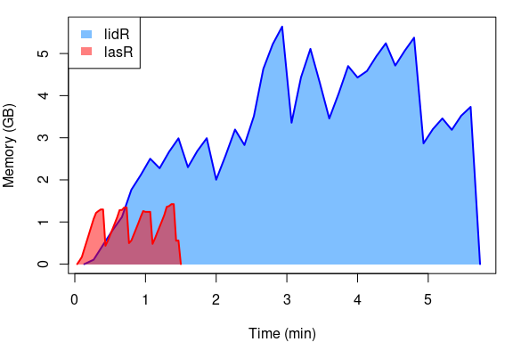

lasR 
======================================================================================================


[](https://github.com/r-lidar/lasR/actions/workflows/R-CMD-check.yaml)
[](https://app.codecov.io/gh/r-lidar/lasR?branch=main)

**Fast Airborne LiDAR Data Processing**

The `lasr` library (pronounced "laser") is a C++ library for large scale point cloud processing with C++, R an python APIs. It enables the creation and execution of complex processing pipelines on massive lidar data. It can read and write `.las`, `.laz` and `.pcd` files, compute metrics using an area-based approach, generate digital canopy models, segment individual trees, thin point data, and process collections of files using multicore processing. 

`lasr` offers a range of tools to process massive volumes of lidar data efficiently in a production environment using either the `C++` API, the R API (`lasR` package) or the `python` (`pylasr` package) API.

- 📖 Start with the [tutorial](https://r-lidar.github.io/lasR/articles/tutorial.html) to learn how to use `lasR` in R.
- 🐍 For Python users, see the [Python documentation](https://github.com/r-lidar/lasR/tree/main/python) and [examples](https://github.com/r-lidar/lasR/tree/main/python/examples).
- 💵 [Sponsor `lasr`](https://github.com/sponsors/Jean-Romain). It is free and open source, but requires time and effort to develop and maintain.

## R API

There is no current plan to release `lasR` on CRAN. Instead, it is hosted on `r-universe`:

```r
install.packages('lasR', repos = 'https://r-lidar.r-universe.dev')
```

Since `lasR` is not available on CRAN, users cannot rely on the CRAN versioning system or the RStudio update button to get the latest version. Instead, when `lasR` is loaded with `library(lasR)`, an internal routine checks for the latest version and notifies the user if an update is available. This approach allows for more frequent updates, ensuring users have access to the newest features and bug fixes without waiting for a formal release cycle.

```r
library(lasR)
#> lasR 0.1.3 is now available. You are using 0.1.1
#> install.packages('lasR', repos = 'https://r-lidar.r-universe.dev')
```

## Python API

`pylasr` is the Python API for `lasr`, providing a clean, Pythonic interface to the high-performance C++ library for processing large-scale LiDAR point clouds.

### Installation

#### Prerequisites

- Python 3.9+
- C++17 compatible compiler
- GDAL (>= 2.2.3), GEOS (>= 3.4.0), PROJ (>= 4.9.3)

#### Build from source

```bash
git clone https://github.com/r-lidar/lasR.git
cd lasR/python
pip install -e .
```

#### Pre-built packages

Pre-built packages will be available on PyPI in the future. For now, please build from source.

## C++ API

To use `lasr` in a C++ program, it must be linked to `gdal` and `proj`. Other dependencies are provided in the `vendor` directory. Tools available to the public are given in [`api.h`](https://github.com/r-lidar/lasR/blob/main/src/LASRapi/api.h)

```cpp
#incude "api.h"

using namespace api;

// platform independent tmp file
std::filesystem::path temp_dir = std::filesystem::temp_directory_path(); 
std::filesystem::path temp_file = temp_dir / "test.las";

Pipeline p;
p.set_files(on);
p.set_concurrent_files_strategy(8);
p.set_progress(true);

p += info() +
  delete_points({"Z > 1.37"}) + 
  write_las(temp_file);

std::string file = p.write_json();

execute(file);
```

## Example

Here is a simple example of how to classify outliers before to produce a Digital Surface Model (DSM) and a Digital Terrain Model (DTM) from a folder containing airborne LiDAR point clouds. For more examples see the  [tutorial](https://r-lidar.github.io/lasR/articles/tutorial.html).

### R

```r
library(lasR)
folder = "/folder/of/laz/tiles/"
pipeline = classify_with_sor() + delete_noise() + chm(1) + dtm(1)
exec(pipeline, on = folder, ncores = 16, progress = T)
```

### Python

```py
import pylasr
folder = "/folder/of/laz/tiles/"
pipeline = (pylasr.classify_with_sor() + 
            pylasr.delete_points(["Classification == 18"]) + 
            pylasr.chm_pipeline(1, "chm.tif") + 
            pylasr.dtm_pipeline(1, "dtm.tif"))

pipeline.set_progress(True)
pipeline.set_concurrent_files_strategy(8)
result = pipeline.execute([folder])
```

## Main Differences with `lidR`

The following benchmark compares the time and RAM usage of `lasR` (R API) and `lidR` for producing a Digital Terrain Model (DTM), a Canopy Height Model (CHM), and a raster containing two metrics derived from elevation (Z) and intensity. The test was conducted on 120 million points stored in 4 LAZ files. For more details, check out the [benchmark vignette](https://r-lidar.github.io/lasR/articles/benchmarks.html).



- **Pipelines**: `lasR` introduces pipelines to optimally chain multiple operations on a point cloud, a feature not available in `lidR`.
- **Algorithm Efficiency**: `lasR` uses more powerful algorithms designed for speed and efficiency.
- **Language and Performance**: Entirely written in C/C++, `lasR` has no R code except for the API interface. This makes it highly optimized for performance.
- **Memory Usage**: Unlike `lidR`, which loads the point cloud into an R `data.frame`, `lasR` stores point clouds in a C++ structure that is not exposed to the user, minimizing memory usage.
- **Dependencies**: `lasR` has a single strong dependency on `gdal`. If `sf` and `terra` are installed, the user experience is enhanced, but they are not mandatory.

For more details, see the relevant [vignette](https://r-lidar.github.io/lasR/articles/why.html#main-differences-between-lasr-and-lidr).

## Copyright Information

`lasR` is free and open source and relies on other free and open source tools.

- For `lasR`:
  - © 2023-2024 Jean-Romain Roussel
  - Licence: GPL-3
- For `pylasr` (Python bindings):
  - © 2025 Alexey Grigoryev
  - Licence: GPL-3
- For `LASlib` and `LASzip`:
  - © 2007-2021 Martin Isenburg - <http://rapidlasso.com>
  - Licence: LGPL  (modified to be R-compliant by Jean-Romain Roussel)
  - See the dedicated readme for more details about the modifications made and alternative linking.
- For `chm_prep`:
  - © 2008-2023 Benoît St-Onge - [Geophoton-inc/chm_prep](https://github.com/Geophoton-inc/chm_prep)
  - Licence: GPL-3
- For `json` parser:
  - Lohmann, N. (2023). JSON for Modern C++ (Version 3.11.3) [Computer software]. https://github.com/nlohmann
  - Licence: MIT
- For `delaunator`:
  - © 2018 Volodymyr Bilonenko. [delfrrr/delaunator-cpp](https://github.com/delfrrr/delaunator-cpp)
  - Licence: MIT
- For `Eigen`:
  - Guennebaud, Gaël and Jacob, Benoît and others
  - Eigen: A C++ linear algebra library http://eigen.tuxfamily.org
  - Licence: MPL2
- For `Cloth Simulation Filter (CSF)`
  - © 2017 State Key Laboratory of Remote Sensing Science, Institute of Remote Sensing Science and Engineering, Beijing Normal University
  - Licence: Apache
  - W. Zhang, J. Qi, P. Wan, H. Wang, D. Xie, X. Wang, and G. Yan, “An Easy-to-Use Airborne LiDAR Data Filtering Method Based on Cloth Simulation,” Remote Sens., vol. 8, no. 6, p. 501, 2016.

## About

`lasR` is developed openly by [r-lidar](https://www.r-lidar.com/).

The initial development of `lasR` was made possible through the financial support of [Laval University](https://www.ulaval.ca/en). To continue the development of this free software, we now offer consulting, programming, and training services. For more information, please visit [our website](https://www.r-lidar.com/).

## Install dependencies on GNU/Linux

```
sudo add-apt-repository ppa:ubuntugis/ubuntugis-unstable
sudo apt-get update
sudo apt-get install libgdal-dev libgeos-dev libproj-dev
```

