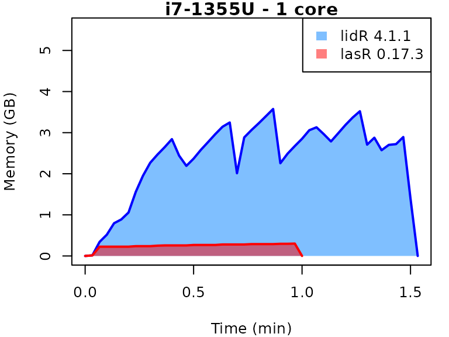
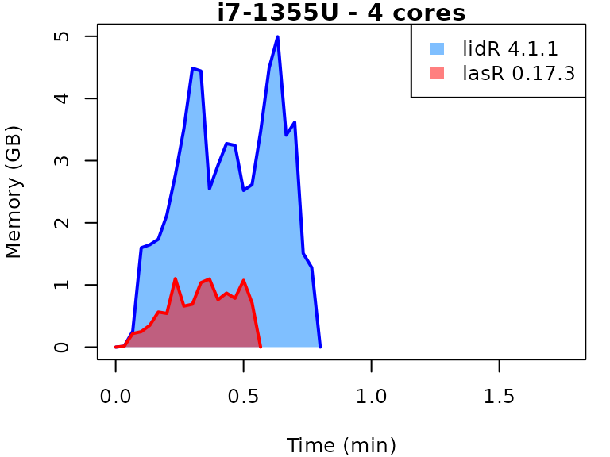
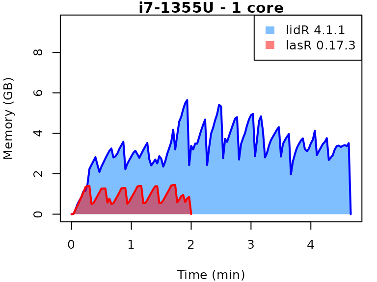
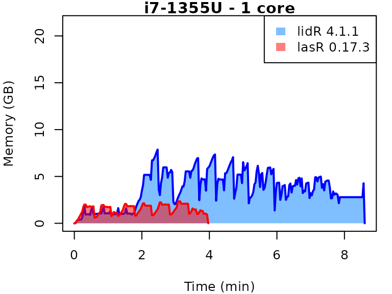
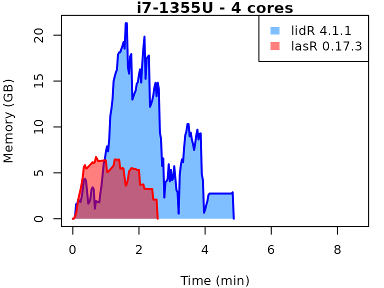

# Benchmarks of lasR vs. lidR

This vignette presents benchmarks for various tasks using `lidR` and
`lasR`. The x-axis represents the time spent on the task, while the
y-axis represents the memory used for the task. The benchmarks are
re-run for every version of `lidR` and `lasR`.

- **Number of files:** 9 (spatially indexed with `.lax` files)
- **Number of points:** 204 million (22 million per file)
- **Coverage:** 20 km² (2.1 km² per file)
- **Density:** 10 points/m²
- **OS:** Linux
- **CPU:** Intel Core i7-1355U (13th generation Intel Core)

In the following the term `1 core` refers to the processing of one
LAS/LAZ file at a time sequentially. But some algorithm such as the
local maximum filter are internally parallelized using half of the
available cores. The term `4 cores` refers to the fact that 4 files are
processed simultaneously. In `lidR` this is done using the package
`future`. In `lasR` this is natively supported.

## Canopy Height Model

### Code

``` r
# lidR
future::plan(future::multicore(...))
chm = rasterize_canopy(ctg, 1, p2r())


# lasR
set_parallel_strategy(...)
pipeline = rasterize(1, "max")
exec(pipeline, on = ctg)
```

### Result



## Digital Terrain Model

### Code

``` r
# lidR
future::plan(future::multicore(...))
dtm = rasterize_terrain(ctg, 1, tin())

# lasR
set_parallel_strategy(...)
tri = triangulate()
pipeline = reader_las(filter = keep_ground()) + tri + rasterize(1, tri)
exec(pipeline, on = ctg)
```

### Result



## Multiple raster

The gain in terms of computation time is much more significant when
running multiple stages in a single pipeline because files are read only
once in `lasR` but multiple times in `lidR`. Here, all operations are
executed in a single pass at the C++ level, resulting in more efficient
memory management.

### Code

``` r
# lidR
future::plan(future::multicore(...))
custom_function = function(z,i) { list(avgz = mean(z), avgi = mean(i)) }
ctg = readLAScatalog(f)
chm = rasterize_canopy(ctg, 1, p2r())
met = pixel_metrics(ctg, ~custom_function(Z, Intensity), 20)
den = rasterize_density(ctg, 5)

# lasR
set_parallel_strategy(...)
custom_function = function(z,i) { list(avgz = mean(z), avgi = mean(i)) }
chm = rasterize(1, "max")
met = rasterize(20, custom_function(Z, Intensity))
den = rasterize(5, "count")
pipeline = chm + met + den
exec(pipeline, on = folder)
```

### Result



## Normalization

### Code

``` r
# lidR
future::plan(future::multicore(...))
opt_output_files(ctg) <- paste0(tempdir(), "/*_norm")
norm = normalize_height(ctg, tin())

# lasR
set_parallel_strategy(...)
pipeline = reader(f) + normalize() + write_las()
processor(pipeline)
```

### Result


## Local maximum

### Code

``` r
# lidR
future::plan(future::multicore(...))
tree = locate_trees(ctg, lmf(5))

# lasR
set_parallel_strategy(...)
pipeline = reader(f) + local_maximum(5)
processor(pipeline)
```

### Result


## Complex Pipeline

In this complex pipeline, the point cloud is normalized and written to
new files. A Digital Terrain Model (DTM) is produced, a Canopy Height
Model (CHM) is built, and individual trees are detected. These detected
trees are then used as seeds for a region-growing algorithm that
segments the trees. The `lasR` pipeline can handle hundreds of laser
tiles, while `lidR` may struggle to apply the same pipeline, especially
during tree segmentation.

### Code

``` r
del = triangulate(filter = keep_ground())
norm = transform_with(del)
dtm = rasterize(1, del)
chm = rasterize(1, "max")
seed = local_maximum(3)
tree = region_growing(chm, seed)
write = write_las()
pipeline = read + del + norm + write + dtm + chm +  seed + tree
ans = exec(pipeline, on = ctg, progress = TRUE)
```

### Result


