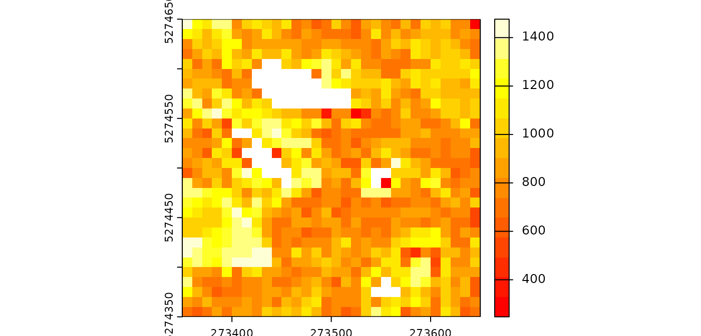

# R stages

`lasR` is a standalone software that can work independently outside of
R. The R part of `lasR` is only an API to conveniently build pipelines,
but this task could be performed by another software such as a Python
package, a QGIS plugin, or dedicated software. Currently, the only
existing API is the `lasR` package.

However, the R package version offers additional stages that allow
injecting R code into the pipeline. These stages cannot exist in
standalone software independent of R.

## Rasterize

In the [tutorial](https://r-lidar.github.io/lasR/articles/tutorial.md),
we mentioned that
[`rasterize()`](https://r-lidar.github.io/lasR/reference/rasterize.md)
supports the injection of a user-defined R expression. This is
equivalent to `pixel_metrics()` from the package `lidR`. Any
user-defined function can be mapped, making it extremely versatile but
slower.

Let’s compute the map of the median intensity by injecting a
user-defined expression. Like in `lidR`, the attributes of the point
cloud are named: `X`, `Y`, `Z`, `Intensity`, `gpstime`, `ReturnNumber`,
`NumberOfreturns`, `Classification`, `UserData`, `PointSourceID`, `R`,
`G`, `B`, `NIR`. For users familiar with the `lidR` package, note that
there is no `ScanAngleRank/ScanAngle`; instead the scanner angle is
always named `ScanAngle` and is numeric. Also flags are named
`Withheld`, `Synthetic` and `Keypoint`.

``` r
pipeline = rasterize(10, median(Intensity))
ans = exec(pipeline, on = f)

terra::plot(ans, mar = c(1, 1, 1, 3), col = heat.colors(15))
```



> Notice that, in this specific case, using `rasterize(10, "i_median")`
> is more efficient.

## Callback

The `callback` stage holds significant importance as the second and last
entry point to inject R code into the pipeline, following
[`rasterize()`](https://r-lidar.github.io/lasR/reference/rasterize.md).
For those familiar with the `lidR` package, the initial step often
involves reading data with `lidR::readLAS()` to expose the point cloud
as a `data.frame` object in R. In contrast, `lasR` loads the point cloud
optimally in C++ without exposing it directly to R. However, with
`callback`, it becomes possible to expose the point cloud as a
`data.frame` for executing specific R functions.

Similar to `lidR`, the attributes of the point cloud in `lasR` are
named: `X`, `Y`, `Z`, `Intensity`, `gpstime`, `ReturnNumber`,
`NumberOfreturns`, `Classification`, `UserData`, `PointSourceID`, `R`,
`G`, `B`, `NIR`. Notably, for users accustomed to the `lidR` package,
the scanner angle is consistently named `ScanAngle` and is numeric, as
opposed to `ScanAngleRank/ScanAngle`. Additionally, flags are named
`Withheld`, `Synthetic`, and `Keypoint`.

Let’s delve into a simple example. For each LAS file, the `callback`
loads the point cloud as a `data.frame` and invokes the `meanz()`
function on the `data.frame`.

``` r
meanz = function(data){ return(mean(data$Z)) }
call = callback(meanz, expose = "xyz")
ans = exec(call, on = f)
print(ans)
#>  - 809.0835 
#>  - 13.27202
```

Here the output is a `list` with two elements because we processed two
files (`f` is not displayed in this document). The average Z elevation
are respectively 809.08 and 13.27 in each file.

> Be mindful that, for a given LAS/LAZ file, the point cloud may contain
> more points than the original file **if the file is loaded with a
> buffer**. Further clarification on this matter will be provided later.

The `callback` function is versatile and can also be employed to edit
the point cloud. When the user-defined function returns a `data.frame`
with the same number of rows as the original one, the function edits the
underlying C++ dataset. This enables users to perform tasks such as
assigning a class to a specific point. While physically removing points
is not possible, users can flag points as `Withheld`. In such cases,
these points will not be processed in subsequent stages, they are
discarded.

``` r
edit_points = function(data)
{
  data$Classification[5:7] = c(2L,2L,2L)
  data$Withheld = FALSE
  data$Withheld[12] = TRUE
  return(data)
}

call = callback(edit_points, expose = "xyzc")
ans = exec(call, on = f)
ans
#> NULL
```

As observed, here, this time `callback` does not explicitly return
anything; however, it edited the point cloud internally. To generate an
output, users must use another stage such as
[`write_las()`](https://r-lidar.github.io/lasR/reference/write.md). It’s
important to note that
[`write_las()`](https://r-lidar.github.io/lasR/reference/write.md) will
**NOT** write the point number 12 which is flagged `withheld`. Neither
any subsequent stage will process it. The point is still in memory but
is discarded.

> For memory and efficiency reasons, it is not possible to physically
> remove a point from the underlying memory in `lasR`. Instead, the
> points flagged as `withheld` will **never be processed**. One
> consequence of this, is that points flagged as withheld in a LAS/LAZ
> file **will not** be processed in `lasR`. This aligns with the
> intended purpose of the flag according to the LAS specification but
> may differ from the default behavior of many software on the market
> including `lidR`.

Now, let’s explore the capabilities of `callback` further. First, let’s
create a lidR-like `read_las()` function to expose the point cloud to R.
In the following example, the user-defined function is employed to
return the `data.frame` as is. When the user’s function returns a
`data.frame` with the same number of points as the original dataset,
this updates the points at the C++ level. Here, we use
`no_las_update = TRUE` to explicitly return the result.

``` r
read_las = function(f, select = "xyzi", filter = "")
{
  load = function(data) { return(data) }
  read = reader(filter = filter)
  call = callback(load, expose = select, no_las_update = TRUE)
  return (exec(read+call, on = f))
}

f <- system.file("extdata", "Topography.las", package="lasR")
las = read_las(f)
head(las)
#>          X       Y        Z Intensity
#> 1 273357.1 5274360 806.5340      1340
#> 2 273357.2 5274359 806.5635       728
#> 3 273357.2 5274358 806.0248      1369
#> 4 273357.2 5274510 809.6303       589
#> 5 273357.2 5274509 809.3880      1302
#> 6 273357.2 5274508 809.4847       123
```

Ground points can also be classified using an R function, such as the
one provided by the `RCSF` package:

``` r
csf = function(data)
{
  id = RCSF::CSF(data)
  class = integer(nrow(data))
  class[id] = 2L
  data$Classification <- class
  return(data)
}

read = reader()
classify = callback(csf, expose = "xyz")
write = write_las()
pipeline = read + classify + write
exec(pipeline, on = f)
```

> [`callback()`](https://r-lidar.github.io/lasR/reference/callback.md)
> exposes the point cloud as a `data.frame`. This is the only way to
> expose the point clouds to users in a manageable way. One of the
> reasons why `lasR` is more memory-efficient and faster than `lidR` is
> that it **does not** expose the point cloud as a `data.frame`. Thus,
> the pipelines using
> [`callback()`](https://r-lidar.github.io/lasR/reference/callback.md)
> are not significantly different from `lidR`. The advantage of using
> `lasR` here is the ability to pipe different stages.

## Buffer

Point clouds are typically stored in multiple contiguous files. To avoid
edge artifacts, each file must be loaded with extra points coming from
neighboring files. Everything is handled automatically, except for the
[`callback()`](https://r-lidar.github.io/lasR/reference/callback.md)
stage. In
[`callback()`](https://r-lidar.github.io/lasR/reference/callback.md),
the point cloud is exposed as a `data.frame` with the buffer, providing
the user-defined function with some spatial context. If `callback` is
used to edit the points, everything is handled internally. However, if
an R object is returned, it is the responsibility of the user to handle
the buffer.

For example, in the following pipeline, we are processing two files, and
[`callback()`](https://r-lidar.github.io/lasR/reference/callback.md) is
used to count the number of points. The presence of
[`triangulate()`](https://r-lidar.github.io/lasR/reference/triangulate.md)
implies that each file will be loaded with a buffer to make a valid
triangulation. Consequently, counting the points in
[`callback()`](https://r-lidar.github.io/lasR/reference/callback.md)
returns more points than
[`summarise()`](https://r-lidar.github.io/lasR/reference/summarise.md)
because
[`summarise()`](https://r-lidar.github.io/lasR/reference/summarise.md)
is an internal function that knows how to deal with the buffer.

``` r
count = function(data) { length(data$X) }
del = triangulate(filter = keep_ground())
npts = callback(count, expose = "x")
sum = summarise()
ans = exec(del + npts + sum, on = f)
print(ans$callback)
#>  - 585020 
#>  - 868951
ans$callback[[1]]+ ans$callback[[2]]
#> [1] 1453971
ans$summary$npoints
#> [1] 1355607
```

We can compare this with the pipeline without
[`triangulate()`](https://r-lidar.github.io/lasR/reference/triangulate.md).
In this case, there is no reason to use a buffer, and the files are not
buffered. The counts are equal.

``` r
ans = exec(npts + sum, on = f)
ans$callback[[1]]+ ans$callback[[2]]
#> [1] 1355607
ans$summary$npoints
#> [1] 1355607
```

To handle the buffer, the user can read the attribute `bbox` of the
`data.frame`. It contains the bounding box of the point cloud without
the buffer or use the column `Buffer` that contains `TRUE` or `FALSE`
for each point. If `TRUE`, the point is in the buffer. The buffer is
exposed only if the user includes the letter `'b'`.

``` r
count_buffer_aware = function(data) {
  bbox = attr(data, "bbox")
  npoints = sum(!data$Buffer)
  return(list(bbox = bbox, npoints = npoints))
}

del = triangulate(filter = keep_ground())
npts = callback(count_buffer_aware, expose = "b") # b for buffer
sum = summarise()
ans = exec(del + npts + sum, on = f)
print(ans$callback)
#>  - List:
#>    - bbox : 885022.4 629157.2 885210.2 629400 
#>    - npoints : 531662 
#>  - List:
#>    - bbox : 885024.1 629400 885217.1 629700 
#>    - npoints : 823945
ans$callback[[1]]$npoints+ ans$callback[[2]]$npoints
#> [1] 1355607
ans$summary$npoints
#> [1] 1355607
```

In conclusion, in the hypothesis that the user-defined function returns
something complex, there are two ways to handle the buffer: either using
the bounding box or using the `Buffer` flag. A third option is to use
`drop_buffer`. In this case users ensure to receive a `data.frame` that
does not include points from the buffer.

## Parallelisation

> Read the [multithreading
> page](https://r-lidar.github.io/lasR/articles/multithreading.md)
> before entering this section.

R is **NOT** multi-threaded, and thus calling these stages in parallel
is not thread-safe and will crash the R session in the best case or
deeply corrupt the R memory in the worst case. Consequently, these
stages are protected and cannot run concurrently with a
`concurrent-file` strategy. These stages are only meant to build complex
but convenient pipelines and do not intend to be production tools. While
`lasR::rasterize(10, mymetrics(Z, Intensity))` produces the same output
as `lidR::pixel_metrics(las, mymetrics(Z, Intensity), 10)`, the `lidR`
version is faster because it can be parallelized on **multiple R
sessions**.

`lasR`, on the other hand, parallelizes the computation in a **single R
session**. This approach has pros and cons which won’t be discussed in
this tutorial. One con is that pipelines using injected R code are not
parallelizable by default.
