# lasR experimental COPC writer — LOD quality and multi-tile merge

- **Date:** 2026-09-30
- **Code:** combined COPC branch at 332117d9 (`devel` + writer + multi-file
  merge + this harness)
- **Dataset:** USGS 3DEP `CA_NorthCoastRanges_B23`
- **Machine, tool versions:** see `REPORT-2026-09-30.md`

It covers three questions:

1. How are the points distributed across the octree levels, for the
   experimental writer and for the five other writers of the benchmark?
2. Does merging four adjacent tiles into one COPC work without a user-supplied
   bounding box?
3. Is anything visible at the former tile boundaries, in the full cloud and in
   each level of detail?

The scripts are `run_multitile_validation.sh` (which calls
`validate_lod_visual.R`, `write_lasR_multitile.R`, `inspect_copc.R` and
`check_edge_artifacts.R`) and `check_z_plane_bands.R`.

## 1. Input data

| field | value |
|---|---|
| tiles | 502378 (anchor), 503378 (E), 502379 (N), 503379 (NE) |
| combined extent | X [502500, 504500] · Y [4378000, 4380000] · 2 × 2 km |
| single-tile points | 45,243,335 |
| sum of the four tile headers | 195,851,148 |
| input format | LAZ, not COPC |

The four tiles come from the same acquisition project and abut: neighbouring
tiles share an edge coordinate but no area.

## 2. LOD quality, single tile

### 2.1 Points per level and density uniformity, six writers

Each writer's output for tile 502378 was read back with `reader(depth = d)`
and counted on a 10 m grid. A read at depth `d` returns levels 0 to `d`, so the
counts are cumulative.

Points returned:

| writer | d0 | d1 | d2 | d3 | d4 | d5 |
|---|---:|---:|---:|---:|---:|---:|
| lasR-experimental | 65,567 | 342,737 | 1,437,424 | 5,877,036 | 20,084,416 | 45,243,335 |
| lasR-experimental-dense | 100,000 | 687,062 | 2,702,361 | 10,231,233 | 32,610,190 | 45,243,335 |
| lasR-default | 66,971 | 400,608 | 1,877,195 | 7,438,469 | 45,243,335 | |
| pdal | 87,635 | 1,095,874 | 4,417,168 | 13,677,742 | 32,667,366 | 45,243,335 |
| untwine | 192,536 | 430,971 | 1,884,204 | 7,175,978 | 24,558,078 | 45,243,335 |
| lascopcindex | 334,402 | 1,811,485 | 7,375,362 | 21,501,772 | 45,243,335 | |

Coefficient of variation of the per-cell count over occupied cells (lower
means a more even density in map view):

| writer | d0 | d1 | d2 | d3 | d4 | d5 |
|---|---:|---:|---:|---:|---:|---:|
| lasR-experimental | 0.195 | 0.162 | 0.150 | 0.145 | 0.169 | 0.371 |
| lasR-experimental-dense | 0.374 | 0.402 | 0.420 | 0.653 | 0.274 | 0.371 |
| lasR-default | 0.500 | 0.454 | 0.494 | 0.523 | 0.371 | |
| pdal | 0.479 | 0.499 | 0.537 | 0.506 | 0.420 | 0.371 |
| untwine | 0.462 | 0.473 | 0.528 | 0.535 | 0.507 | 0.371 |
| lascopcindex | 0.461 | 0.498 | 0.525 | 0.481 | 0.371 | |

- 0.371 is the value for the full cloud, identical for every writer.
- Between 98.6 % and 99.2 % of the grid cells are occupied for every writer at
  every depth.
- In its coarse levels the normal preset of the experimental writer has a CV
  of 0.15 to 0.20. The four other writers are between 0.42 and 0.54.
- The dense preset is between 0.27 and 0.65, with its highest value at
  depth 3. That level has horizontal density bands, tracked in [#342](https://github.com/r-lidar/lasR/issues/342).
- `validate_lod_visual.R` labels a CV below 0.6 GOOD. By that threshold every
  entry is GOOD except the dense preset at depth 3. The threshold does not
  separate the writers; the values do.

### 2.2 Density rasters

One figure per writer, one panel per depth; the dense preset is left out
until [#342](https://github.com/r-lidar/lasR/issues/342) is resolved. All panels of a figure share one
colour scale, dominated by the full-depth panel, so the first two or three
panels are nearly uniform in colour for every writer; the table above is the
better guide for those levels.

#### lasR-experimental (normal preset)

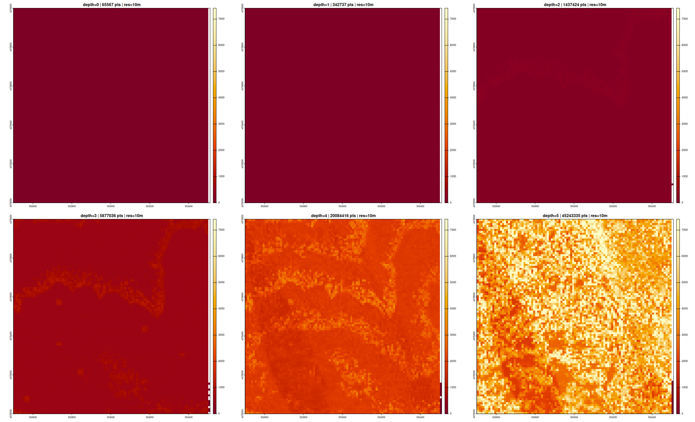

- Depths 0 to 2: no structure visible at this colour scale.
- Depths 3 and 4: curved bands of higher density that run across the tile,
  one or two at depth 3 and more at depth 4. Section 2.3 looks at them.
- Depth 3: a few axis-aligned square patches of higher density, two to three
  cells wide. They are not present in the full-depth panel. Their cause was not
  investigated.

#### Untwine, PDAL, lascopcindex, lasR legacy

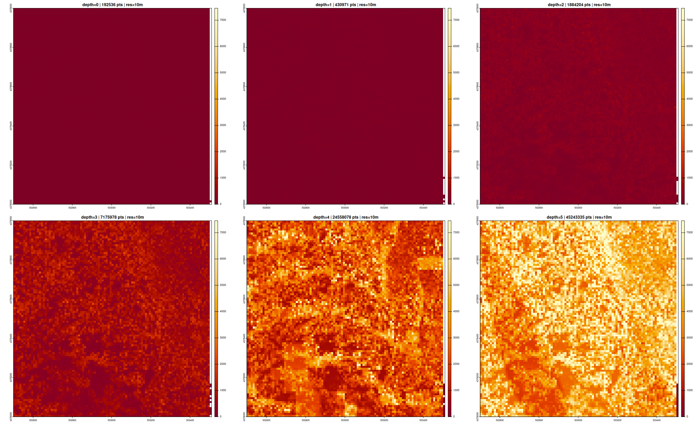

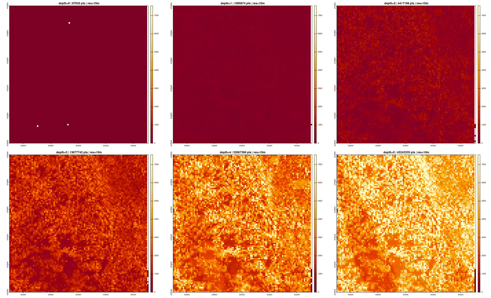

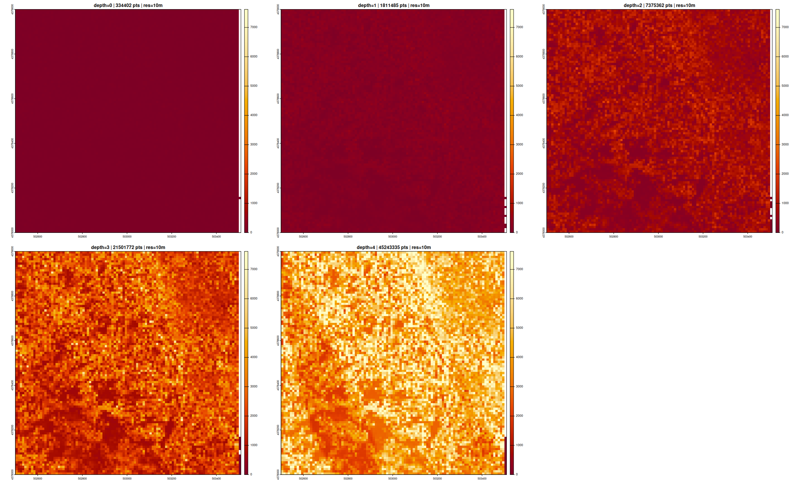

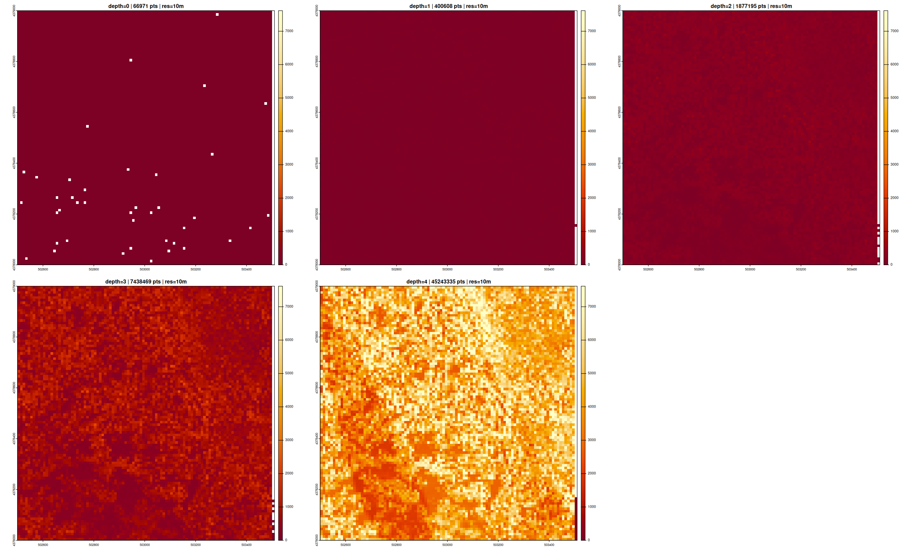

- For these four writers each coarse panel looks like a dimmer version of the
  full-depth panel: where the input is denser, the coarse level is denser.
- Untwine at depth 4 shows rectangular patches of differing density; PDAL at
  depth 4 shows them less distinctly.
- No bands or stripes are visible.

### 2.3 The curved bands follow the octree's z boundaries

`check_z_plane_bands.R` tests one explanation for the curved bands. For each
depth it marks a 10 m cell as "high" when its count exceeds 1.25 × the median,
and as "crossing" when the z range of the points in that cell spans a boundary
between two octree cells of that depth. The table gives the share of crossing
cells among the high cells and among the other cells.

| writer | d1 high / rest | d2 high / rest | d3 high / rest | d4 high / rest |
|---|---:|---:|---:|---:|
| lasR-experimental | 99.9 / 3.8 | 100.0 / 4.2 | 94.6 / 11.7 | 99.1 / 35.7 |
| lasR-experimental-dense | 25.3 / 3.9 | 38.3 / 1.2 | 27.0 / 13.3 | 70.9 / 36.2 |
| lasR-default | 16.6 / 8.6 | 15.4 / 8.9 | 22.7 / 17.1 | 55.1 / 38.7 |
| lascopcindex | 15.4 / 8.9 | 14.6 / 9.2 | 22.4 / 17.3 | 55.1 / 38.7 |
| untwine | n/a | 11.1 / 12.6 | 26.6 / 19.1 | 71.3 / 30.0 |
| pdal | n/a | 11.0 / 12.6 | 25.8 / 19.5 | 63.0 / 35.5 |

- For the normal preset, 95 to 100 % of the high cells are crossing cells at
  every coarse depth. The median count of crossing cells is 15 to 42 % above
  that of the other cells (47 against 33 at depth 1, 2148 against 1865 at
  depth 4).
- Depth 4 of `lasR-default` and `lascopcindex` is the full cloud. It shows
  what the input alone gives: 55 % against 39 %. Tall point columns hold more
  points and also cross a boundary more often, so some association is expected
  for any writer.
- Untwine and PDAL have no z boundary inside the data at depth 1 (their octree
  starts at the lowest point, lasR's and `lascopcindex`'s are centred on the
  data). At depth 4 they show a stronger association than the 55 % against
  39 % of the full cloud.
- In the writer, levels up to `xy_lod_depth` keep one point per XY cell per
  octant (`compute_xy_cell` within `occupancy[k_d]` in `COPCwriter.cpp`). A
  map cell whose points fall into two octants stacked in z is therefore
  sampled once in each. The measurement agrees with that.

### 2.4 3D views

Potree 1.8 views of `lasR-experimental.copc.laz`, read over HTTP range
requests, coloured by elevation. Each view draws octree levels 0 to `d` and
nothing else: the point budget is set above the file's point count and
Potree's rule that always draws levels 0 to 2 is disabled. Point size goes
from 5 px at depth 0 to 1 px at depth 5. The viewer page and the capture
script are local tooling and are not part of this harness.

| | | |
|:---:|:---:|:---:|
| 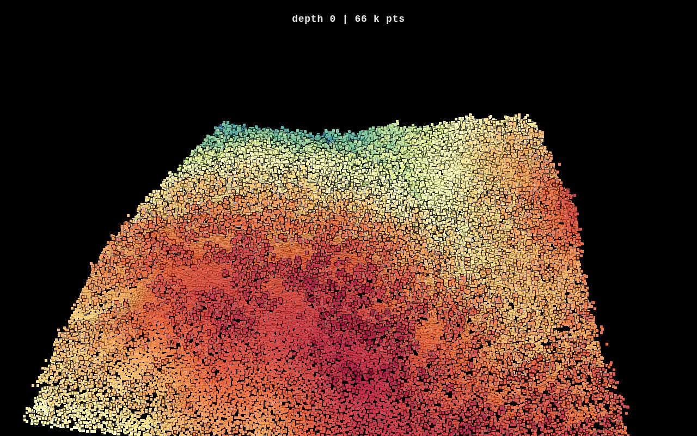 | 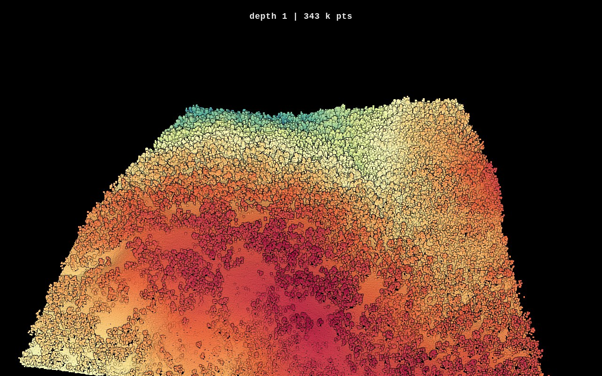 | 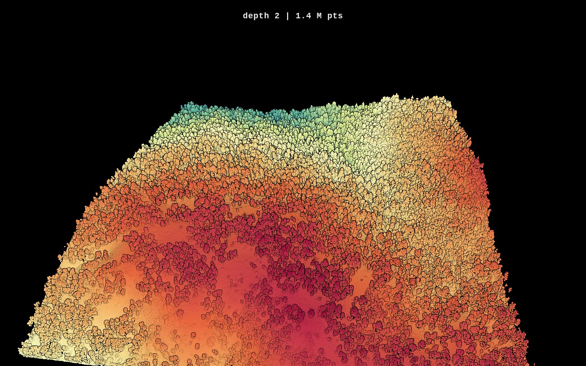 |
| depth 0 — 65,567 points | depth 1 — 342,737 points | depth 2 — 1,437,424 points |
| 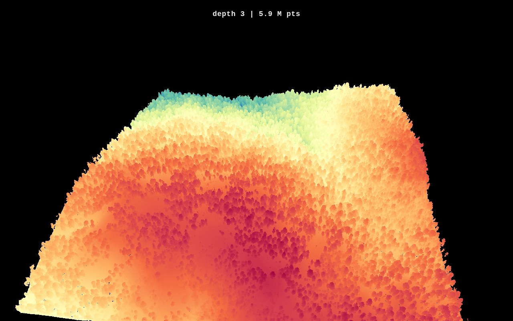 |  |  |
| depth 3 — 5,877,036 points | depth 4 — 20,084,416 points | depth 5 — 45,243,335 points |

- Potree reported exactly the expected number of points drawn at depths 0
  to 3, 20,040,548 of 20,084,416 at depth 4 and 45,013,675 of 45,243,335 at
  depth 5. The near corners of the tile are outside the frame.
- At depth 0 the points cover the whole tile, with gaps between the 5 px
  squares towards the near edge. No band, stripe or block is visible in the
  depth 0 and depth 1 views.

## 3. Multi-tile merge

### 3.1 Setup and result

```r
pipeline <- reader() + write_copc(
  ofile               = "merged_experimental.copc.laz",
  density             = "normal",
  experimental_writer = TRUE
)
exec(pipeline, on = c("502378.laz", "502379.laz", "503378.laz", "503379.laz"))
```

No `bbox` is passed: the writer takes the union bounding box and the total
point count from the file collection.

| metric | value |
|---|---|
| input | 4 tiles, 985 MB |
| output | 1,238 MB |
| write time | 249.7 s (one run) |
| points | 195,852,101 (953 more than the tile headers sum to, see 4.3) |
| max depth | 6 |
| hierarchy nodes | 10,704 |
| octree centre | X 503500.01 · Y 4379000.00 · Z 1556.31, half size 1000 |
| peak RSS | not measured by `write_lasR_multitile.R` |

### 3.2 Density per depth

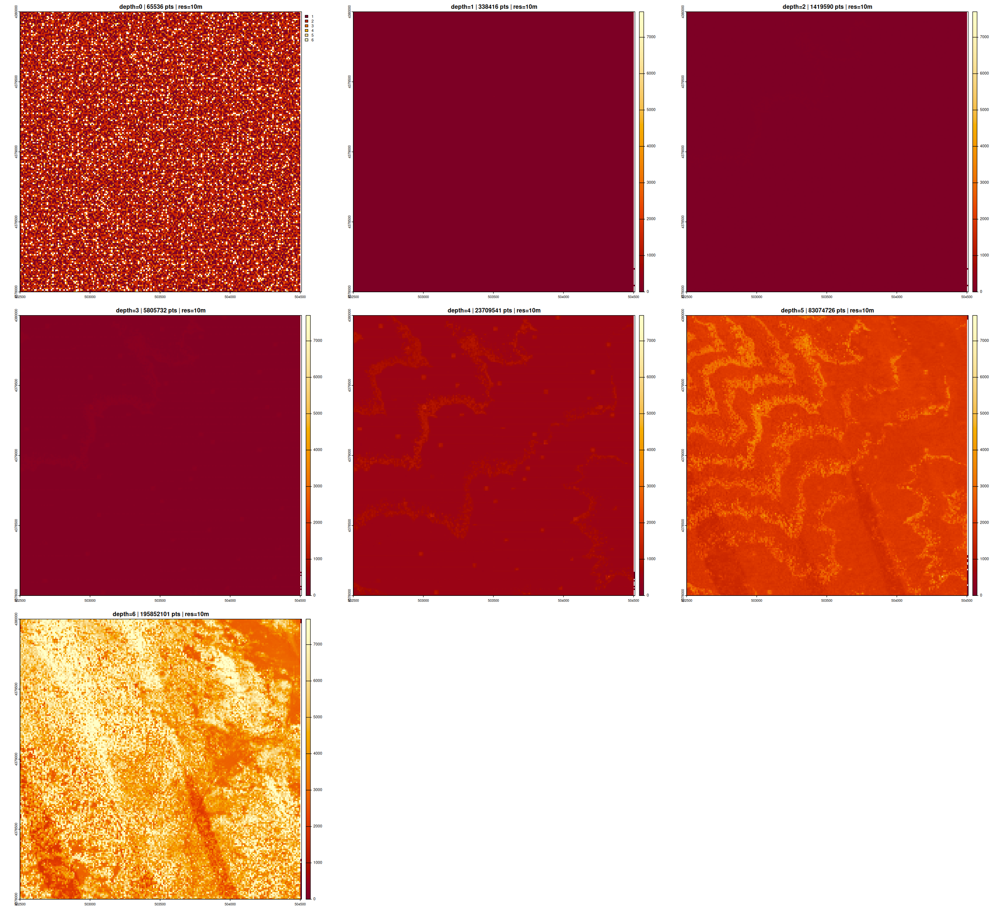

| depth | points | coverage % | median pts / cell | CV |
|---:|---:|---:|---:|---:|
| 0 | 65,536 | 92.2 | 2 | 0.431 |
| 1 | 338,416 | 99.5 | 8 | 0.239 |
| 2 | 1,419,590 | 99.5 | 35 | 0.159 |
| 3 | 5,805,732 | 99.5 | 140 | 0.141 |
| 4 | 23,709,541 | 99.5 | 561 | 0.151 |
| 5 | 83,074,726 | 99.6 | 1,981 | 0.163 |
| 6 | 195,852,101 | 99.6 | 4,627 | 0.355 |

- Depth 0 holds a median of 2 points per 10 m cell, so its CV and coverage
  are dominated by counting noise at this cell size.
- Depths 3 to 5 show the same curved bands as the single tile. The z-boundary
  test gives the same result: 99.7 %, 81.9 %, 91.5 % and 98.6 % of the high
  cells are crossing cells at depths 2, 3, 4 and 5, against 1.6 %, 2.3 %,
  10.5 % and 28.0 % of the other cells.
- Depth 4 shows small square patches of higher density, as at depth 3 of the
  single tile.
- Depth 6 (every point) shows a straight diagonal feature of lower density in
  the south-east tile. It is also in the full-cloud map of section 4.1, so it
  is in the input.
- No straight feature runs along X = 503500 or Y = 4379000 in any panel.

### 3.3 Coarse levels seen from above

Potree views of the merged file from above, levels 0 to `d` only, coloured by
elevation. The tile seams cross at the centre of each image.

| | | |
|:---:|:---:|:---:|
| 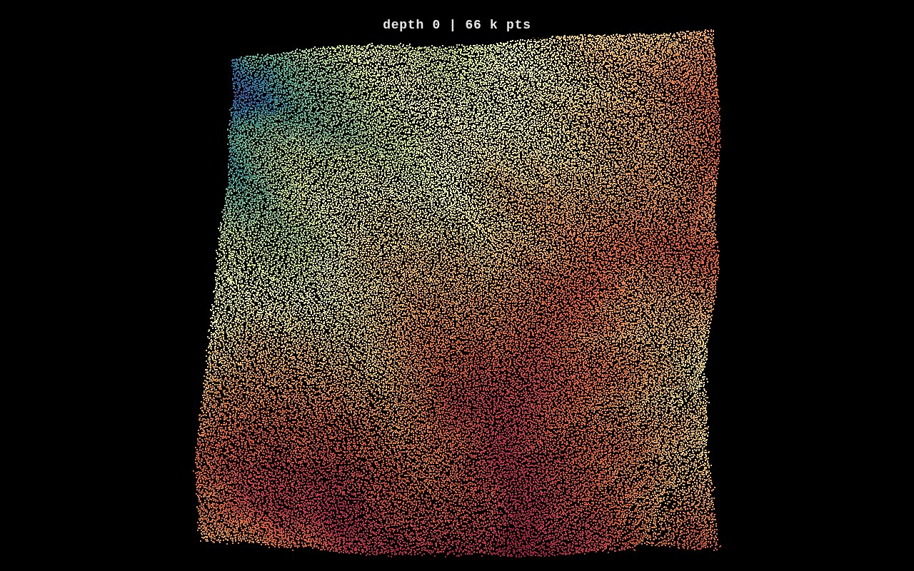 | 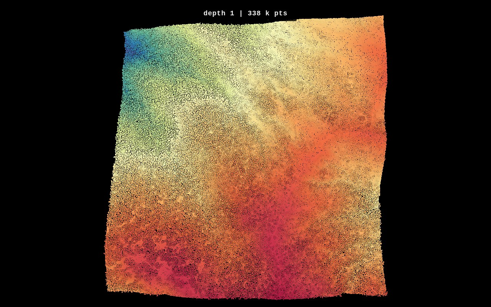 | 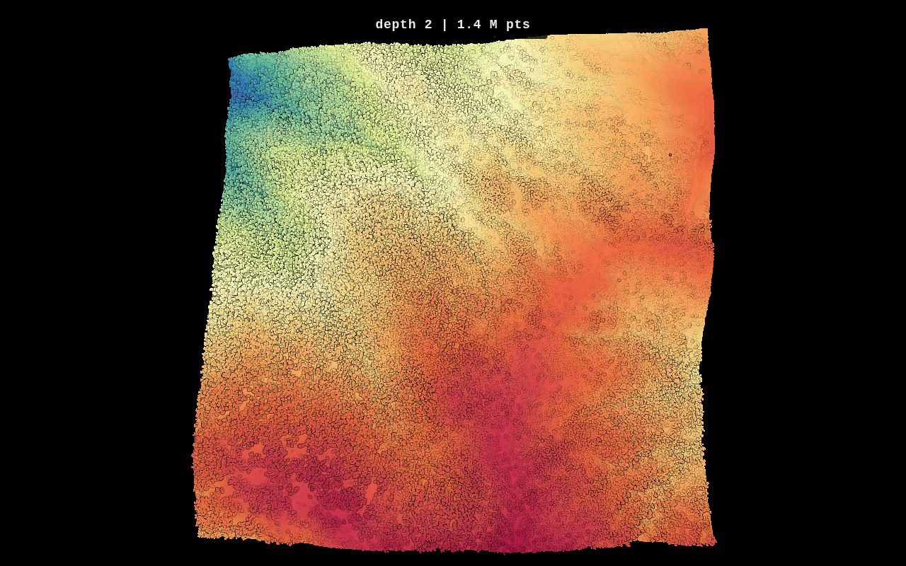 |
| depth 0 — 65,536 points | depth 1 — 338,416 points | depth 2 — 1,419,590 points |

Potree drew exactly the expected number of points in each view. No line,
change of density or change of pattern is visible along either seam.

## 4. Tile boundaries

### 4.1 Full cloud

`check_edge_artifacts.R` counts every point of the merged file on a 10 m grid
and compares the median of a ±30 m strip along each seam with the median of
the interior (4,675 points per cell).

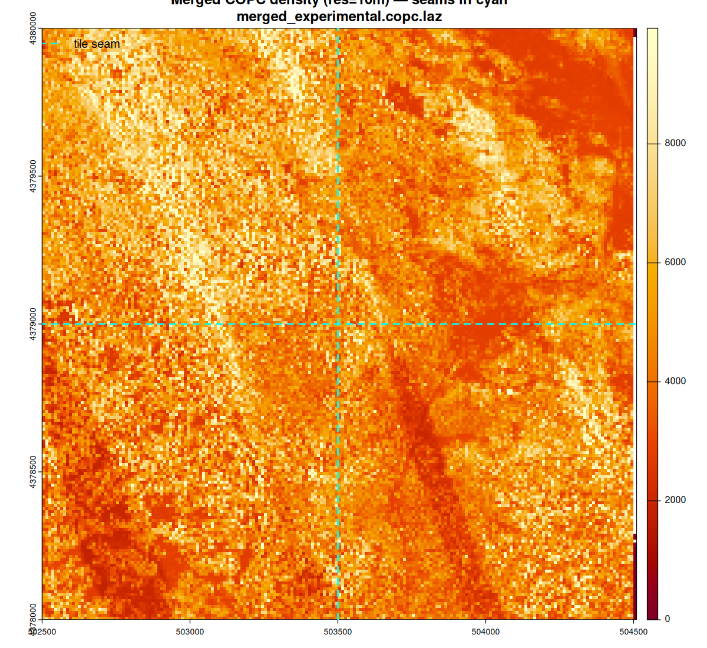

| seam | strip median | ratio to interior | flag |
|---|---:|---:|---|
| X = 503500 | 4,882.5 | 1.04 | ok |
| Y = 4379000 | 4,528.0 | 0.97 | ok |

This test reads every point, so its result does not depend on how the writer
distributed the points over the levels. It would flag a gap or a pile-up
along a seam that changes the 10 m counts by half or more. It cannot show a
tile-boundary artifact in the coarse levels, and it cannot see a few
hundred duplicated points (4.3).

### 4.2 Per level of detail

`check_edge_artifacts.R` also repeats the comparison on the points visible at
each depth and writes `seam_stats_by_depth.csv`. For each depth, the mean
count of the two cell columns (or rows) that touch the seam is divided by the
mean over the whole raster. The last three columns describe all column and
row means at that depth, to show what ordinary variation looks like.

| depth | X seam | Y seam | sd of all columns / rows | min | max |
|---:|---:|---:|---:|---:|---:|
| 0 | 1.016 | 0.998 | 0.028 / 0.026 | 0.92 | 1.08 |
| 1 | 1.044 | 1.015 | 0.036 / 0.043 | 0.95 | 1.14 |
| 2 | 1.021 | 1.019 | 0.035 / 0.040 | 0.96 | 1.13 |
| 3 | 1.024 | 1.000 | 0.029 / 0.038 | 0.96 | 1.12 |
| 4 | 0.995 | 1.011 | 0.032 / 0.040 | 0.95 | 1.14 |
| 5 | 1.008 | 0.989 | 0.035 / 0.041 | 0.92 | 1.11 |
| 6 | 1.045 | 0.959 | 0.097 / 0.084 | 0.78 | 1.23 |

- At depths 0 to 5 the columns and rows that touch a seam are within 4.4 % of
  the mean of their depth. The largest deviation, 1.044 at depth 1, is 1.2
  standard deviations of the column means at that depth, and other columns of
  the same depth reach 1.10.
- Depth 6 is the full cloud: 1.045 and 0.959 are what the input has along
  those lines.

### 4.3 Duplicated points on the seams

The merged file holds 195,852,101 points. The four tile headers sum to
195,851,148, which is 953 fewer. `check_edge_artifacts.R` reports that
difference and counts, within 0.05 m of each seam, the points of the merged
file that share X, Y, Z, GPS time and return number with another point.

| seam | points within 0.05 m | duplicated |
|---|---:|---:|
| X = 503500 | 11,406 | 444 |
| Y = 4379000 | 11,147 | 509 |

- 444 + 509 = 953. The surplus consists of points that are in the file
  twice, and all of them lie exactly on X = 503500.00 or Y = 4379000.00.
- The header bounds of neighbouring tiles share those coordinates: tile
  502378 ends at X 503500.00 and tile 503378 starts there; tile 503378 ends
  at Y 4379000.00 and tile 503379 starts there.
- Each tile read on its own returns its header count. The four tiles read as
  one collection with `reader() + summarise()` return 195,852,101, and they
  do so with unmodified `devel` (5592b69f) as well. The duplicates therefore
  come from how lasR reads a collection of abutting tiles. The COPC writer
  writes the points it is given.
- Without the duplicates the merged count equals the sum of the tile
  headers, so no point was lost.
- 953 points are 0.0005 % of the cloud.

### 4.4 Limits of this check

- The octree of the merged file is centred at X 503500.01, Y 4379000.00, so
  the tile seams coincide with the first split planes of the octree. This
  dataset cannot tell a tile-seam effect from an octree-plane effect. Neither
  shows.
- The grid is 10 m. A feature narrower than a cell is averaged over it.
- The four tiles come from one project, hold 44.8 to 59.6 million points each
  and share no area. Tiles from different acquisitions, overlapping tiles, or
  a block whose seams do not fall on octree planes were not tested.
- The merge was run once.

## 5. Summary

| question | result |
|---|---|
| Points per level | Normal preset: 65,567 at depth 0, 342,737 at depth 1, five levels below the root |
| Evenness of the coarse levels in map view | Normal preset CV 0.15 to 0.20; other writers 0.42 to 0.54; dense preset 0.27 to 0.65 |
| Patterns in the normal preset | Bands of 15 to 42 % higher density where a point column spans two octree cells in z; a few small square patches at depth 3 |
| Patterns in the dense preset | Horizontal density bands at depth 3, tracked in [#342](https://github.com/r-lidar/lasR/issues/342) |
| Multi-tile merge without `bbox` | Works: 4 tiles, 195,852,101 points, depth 6 |
| Points lost in the merge | None |
| Points duplicated in the merge | 953, exactly on shared tile edges; the same happens when the tiles are read with unmodified `devel` |
| Seam visible in a coarse level | Not at 10 m resolution on this dataset |
