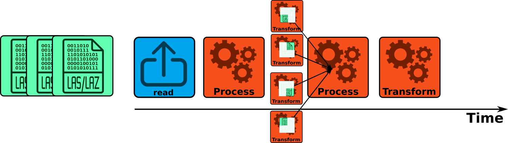
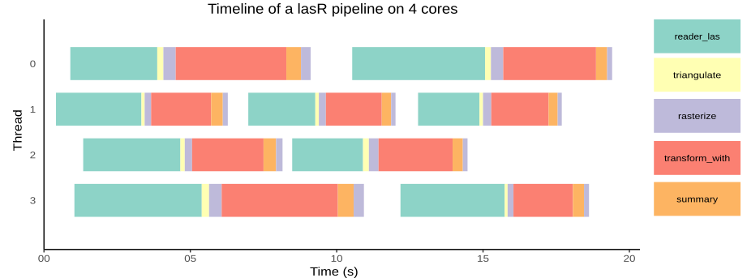

```{r, include = FALSE}
knitr::opts_chunk$set(
  collapse = TRUE,
  comment = "#>"
)
```

```{r setup, echo=FALSE}
suppressPackageStartupMessages(library(lasR))
col = grDevices::colorRampPalette(c("blue", "cyan2", "yellow", "red"))(25)
```

The multi-threading in `lasR` is pretty similar to `lidR`, except it does not use the package `future`. Everything is natively coded in C++ with `OpenMP`. There are 4 different parallelization strategies that can be assigned for a given task with `exec(pipeline, ncores = strategy_name(n))` or that can be assigned globally for the entiere session with `set_parallel_strategy(strategy_name(n))`.

<blockquote style="background-color: #f8d7da; border-left: 5px solid #dc3545; padding: 10px; font-size: 14px; border-radius: 5px;">
`lasR` uses `OpenMP` which means that the package supports parallelism on Linux and Windows but not on macOS where Apple has explicitly disabled `OpenMP` support in compilers that they ship in `Xcode`. Interested readers can read the following links: [OpenMP on macOS](https://mac.r-project.org/openmp/); [OpenBLAS and OpenMP on macOS](https://www.btskinner.io/code/install-r-with-openblas-and-openmp-on-macos-mojave/) ; [Enable OpenMP for macOS](https://github.com/Rdatatable/data.table/wiki/Installation#Enable-openmp-for-macos)
</blockquote>

## Sequential strategy

```r
set_parallel_strategy(sequential())
# or
exec(pipeline, on = f, ncores = sequential())
```

The sequential strategy is **not** the default strategy. However, it is easier to start with this option to explain some specificities of `lasR`. In sequential processing, as the name indicates, the LAS/LAZ files are processed sequentially, and nothing is parallelized. The point cloud from one file passes through the pipeline while the other files are waiting to be processed. This is represented in the figure below.


{width=600px}

## Concurrent points strategy

```r
set_parallel_strategy(concurrent_points(4))
# or
exec(pipeline, on = f, ncores = concurrent_points(4))
```

Concurrent points with `half_cores()` is the default strategy. The LAS/LAZ files are processed sequentially. The point cloud from one file passes through the pipeline while the other files are waiting. Inside the pipeline, some stages are parallelized and are processing the points in different threads. Each core processes a subset of the point cloud. The stages that are parallelized are consequently faster, but in practice, not a lot of stages can easily be parallelized this way.

{width=600px}

## Concurrent files strategy

```r
set_parallel_strategy(concurrent_files(4))
# or
exec(pipeline, on = f, ncores = concurrent_files(4))
# or
exec(pipeline, on = f, ncores = 4) # more convenient
```

The LAS/LAZ files are processed in parallel. The point cloud from several files passes through several cloned pipelines while the other files are waiting. Inside the pipeline, the stages are not parallelized. This puts a lot of pressure on the disk because many LAS/LAZ files are read simultaneously, but also each stage can write some raster/vector/LAS files simultaneously. Additionally, it uses a lot of memory since many LAS files are loaded in memory simultaneously. With modern and fast SSD disks and a significant amount of RAM, this is the fastest option. Of course, users **should not** use all their cores; otherwise, they may run out of memory. See also the [benchmarks](benchmarks.html) vignette.

{width=600px}

## Nested strategy

```r
set_parallel_strategy(nested(4, 2))
# or
exec(pipeline, on = f, ncores = nested(4, 2))
```

The LAS/LAZ files are processed in parallel. The point cloud from several files passes through several cloned pipelines while the other files are waiting. Inside the pipeline, some stages are also parallelized and are processing the points in different threads. Nested is reserved for experts only.


{width=600px}

## Special cases

In `lasR`, everything is written in pure C++ except for two stages that inject user-defined R code and use the R C API (see [R stages](r-stages.html))

```r 
rasterize(20, user_function(Z))
callback(user_function(data))
```

R is **NOT** multi-threaded, and thus calling these stages in parallel is not thread-safe and will crash the R session in the best case or deeply corrupt the R memory in the worst case. Consequently, these stages are protected and pipelines involving these stages cannot be ran in parallel with the `concurrent-files` strategy.

## Real timeline

In the figures above, the pipelines are represented in an idealized and simplified manner. For example, all stages are depicted as taking the same amount of time, and all the cores are shown running in parallel without any overhead. While this simplification aids understanding, it does not capture the full complexity of the actual process. The actual timeline of a real pipeline processing of 9 files is shown in the figure below.


