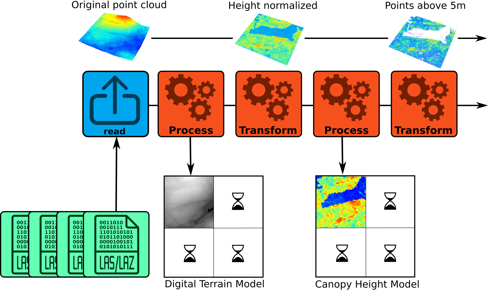
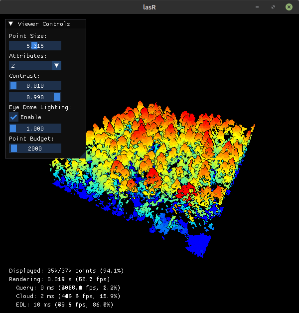

```{r, include = FALSE}
knitr::opts_chunk$set(
  collapse = TRUE,
  comment = "#>"
)
```

```{r setup, echo = FALSE}
suppressPackageStartupMessages(library(lasR))
col = grDevices::colorRampPalette(c("blue", "cyan2", "yellow", "red"))(15)
print.list <- function(my_list, indent = 0) {
  if (is.null(names(my_list))) {
    for (element in my_list) {
      if (is.list(element)) {
        cat(rep(" ", indent), "- List:\n")
        print.list(element, indent + 1)
      } else {
        cat(rep(" ", indent), "-", element, "\n")
      }
    }
  } else {
    for (i in seq_along(my_list)) {
      name = names(my_list)[i]
      cat(rep("  ", indent), "-", name, ": ")
      if (is.list(my_list[[i]])) {
        cat("\n")
        print.list(my_list[[i]], indent + 1)
      } else {
        cat(my_list[[i]], "\n")
      }
    }
  }
}
```

This tutorial is intended to be read in order. It introduces the available tools of the package in a specific order so that the reader can discover all the features of the package organically.

<blockquote style="background-color: #d6e9f9; border-left: 5px solid #428bca; padding: 10px;font-size: 14px; border-radius: 5px;">
In the following tutorial, the variable `f` refers to one or several file paths stored in a vector. It can also be the path to a directory or the path of a  [virtual point cloud](https://www.lutraconsulting.co.uk/blog/2023/06/08/virtual-point-clouds/). It can also be a point cloud loaded in memory. In this tutorial, the output is rendered with one or two small LAS files, but every pipeline is designed to support the processing of numerous files covering a large extent.
</blockquote>

## Overall functionality

In `lasR`, the R functions provided to the user are not designed to process the data directly; instead, they are used to create a pipeline. A pipeline consists of atomic stages that are applied to a point cloud in order. Each stage can either transform the point cloud within the pipeline without generating any output or process the point cloud to produce an output.

In the figure below, there are 4 LAS/LAZ files and a pipeline that (1) reads a file, (2) builds and writes a DTM on disk, (3) transforms the point cloud by normalizing the elevation, (4) builds a canopy height model using the transformed point cloud, and (5) transforms the point cloud by removing points below 5 m. The resulting version of the point cloud (points above 5m) is discarded and lost because there is no additional stage in this pipeline. However, other stages can be added, such as the application of a predictive model for points above 5 m or a stage that writes the point cloud to disk.

Once the first file completes the entire pipeline, the second file is used, and the pipeline is applied to fill in the missing parts of the geospatial rasters or vectors produced by the pipeline. Each file is loaded with a buffer from neighboring files if needed.

A pipeline created from the R interface does nothing initially. After building the pipeline, users must call the `exec()` function on it to initiate the computation.



## Reader

The `reader()` stage MUST be the first stage of any pipeline (blue in the figure above). This stage reads the point cloud. When creating a pipeline with only this stage, the header of the files are read, but no computation is actually applied. No result is returned.

```{r, echo = F}
f = paste0(system.file(package="lasR"), "/extdata/bcts")
```

```{r reader}
pipeline = reader()
exec(pipeline, on = f)
```

In practice when using `reader()` without argument it can be omitted, the function `exec` adds it on-the-fly.

## Triangulate

The first stage we can try is `triangulate()`. This algorithm performs a Delaunay triangulation on the points of interest. Triangulating points is a very useful task that is employed in numerous processing tasks. Triangulating all points is not very interesting, so we usually want to use the `filter` argument to triangulate only specific points of interest.

In the following example, we triangulate the points classified as 2 (i.e., ground). This produces a meshed Digital Terrain Model. The files are read sequentially, with points loaded one by one and stored to build a Delaunay triangulation. The program stores the point cloud and the Delaunay triangulation for the current processing file. Then the data are discarded to load a new file.

If the users do not provide a path to an output file to store the result, the result is lost. In the following pipeline, we are building a triangulation of the ground points, but we get no output because everything is lost.

```{r, echo = FALSE}
f <- system.file("extdata", "Topography.las", package="lasR")
```

```{r triangulate1}
pipeline = reader() + triangulate(filter = "Classification == 2")
ans = exec(pipeline, on = f)
ans
```

In the following pipeline the triangulation is stored in a geopackage file by providing an argument `ofile`:

```{r triangulate2, fig.width=5, fig.height=5}
pipeline = reader() + triangulate(filter = keep_ground(), ofile = tempgpkg())
ans = exec(pipeline, on = f)
ans

par(mar = c(2, 2, 1, 1))
plot(ans, axes = T, lwd = 0.5,  cex.axis = 0.5)
```

Notice the use of `keep_ground()` which is a shortcut for `"Classification == 2"`. We can also triangulate the first returns. This produce a meshed Digital Surface Model.

```r
read = reader()
del = triangulate(filter = keep_first(), ofile = tempgpkg())
ans = exec(read+del, on = f)
```

We can also perform both triangulations in the same pipeline. **The idea of `lasR` is to execute all the tasks in one pass using a pipeline:**

```r
read = reader()
del1 = triangulate(filter = keep_ground(), ofile = tempgpkg())
del2 = triangulate(filter = keep_first(), ofile = tempgpkg())
pipeline = read + del1 + del2
ans = exec(pipeline, on = f)
```

Using `triangulate()` without any other stage in the pipeline is usually not very useful. Typically, `triangulate()` is employed without the `ofile` argument as an intermediate step. For instance, it can be used with `rasterize()`.

## Rasterize

`rasterize()` does exactly what users may expect from it and even more. There are three variations:

1. Rasterize a Delaunay triangulation.
2. Rasterize with predefined operators. The operators are optimized internally, making the operations as fast as possible.
3. Rasterize by injecting a user-defined R expression. This is equivalent to `pixel_metrics()` from the package `lidR`. Any user-defined function can be mapped, making it extremely versatile but slower.

With these variations, users can build a CHM, a DTM, a predictive model, or anything else. 

### Rasterize - triangulation

Let's build a DTM using a triangulation of the ground points and the `rasterize()` stage. In the following pipeline, the LAS files are read, points are loaded for each LAS file **with a buffer**, a Delaunay triangulation of the ground points is built, and then the triangulation is interpolated and rasterized. By default, `rasterize()` writes the raster in a temporary file, so the result is not discarded.

```{r rasterize}
# omitting reader() for the example
del = triangulate(filter = keep_ground())
dtm = rasterize(1, del)
pipeline = del + dtm
ans = exec(pipeline, on = f)
ans
```

Here, `exec()` returns only one `SpatRaster` because `triangulate()` returns nothing (`NULL`). Therefore, the pipeline contains two stages, but only one returns something.

```{r plotdtm, fig.height=3.5}
terra::plot(ans, col = gray.colors(25,0,1), mar = c(1, 1, 1, 3))
```

Notice that, contrary to the `lidR` package, there is usually no high-level function with names like `rasterize_terrain()`. Instead, `lasR` is made up of low-level atomic stages that are more versatile but also more challenging to use. 

### Rasterize - internal metrics

Internal metrics are strings with a format `attribute_function`. `attribute` is an attribute of the point cloud such as `z`, `classification`, or `intensity`. `function` is an available metrics function such as `mean`, `max`, or `sd`. The following are examples of valid metric strings: `z_max`, `i_mean`, `intensity_mean`, `classification_mode`, `z_sd`. Readers can refer to the official documentation to discover all the possible combinations.

Let's build two CHMs: one based on the highest point per pixel with a resolution of 2 meters, and the second based on the triangulation of the first returns with a resolution of 50 cm.

In the following pipeline, we are using two variations of `rasterize()`: one capable of rasterizing a triangulation and the other capable of rasterizing the point cloud with a predefined operator (here `max` is interpreted as `z_max` in absence of explicit attribute). The output is a named `list` with two `SpatRaster`.

```{r, echo = FALSE}
f <- system.file("extdata", "Megaplot.las", package="lasR")
```

```{r rasterize2, fig.show="hold", fig.height=6,  out.width="50%"}
del <- triangulate(filter = keep_first())
chm1 <- rasterize(2, "max")
chm2 <- rasterize(0.5, del)
pipeline <- del + chm1 + chm2
ans <- exec(pipeline, on = f)

terra::plot(ans[[1]], mar = c(1, 1, 1, 3), col = col)
terra::plot(ans[[2]], mar = c(1, 1, 1, 3), col = col)
```

<blockquote style="background-color: #d6e9f9; border-left: 5px solid #428bca; padding: 10px;font-size: 14px; border-radius: 5px;">
For simplicity the package has pre-installed pipelines named `chm()` and `dtm()` that do what is explained above.
</blockquote>

### Rasterize - R expression

This special case is covered in a special tutorial about [R-based stages](r-stages.html)

### Rasterize - buffered

The `lasR` package introduced the concept of a buffered area-based approach to enhance the resolution of prediction maps. However, this concept is not covered in detail in this tutorial. For further information, readers can refer to the [dedicated article](baba.html)

## Transform with

Another way to use a Delaunay triangulation is to transform the point cloud. Users can add or subtract the triangulation from the point cloud, effectively normalizing it. Unlike the `lidR` package, there is no high-level function with names like `normalize_points()`. Instead, `lasR` is composed of low-level atomic stages that offer more versatility.

Let's normalize the point cloud using a triangulation of the ground points (meshed DTM).

In the following example, the triangulation is used by `transform_with()` that modifies the point cloud in the pipeline. Both `triangulate()` and `transform_with()` return nothing. The output is `NULL`.

```{r, echo = FALSE}
f <- system.file("extdata", "Topography.las", package="lasR")
```

```{r twt, warning=FALSE}
del = triangulate(filter = keep_ground())
norm = transform_with(del, "-")
pipeline = del + norm
ans = exec(pipeline, on = f)
ans
```

<blockquote style="background-color: #d6e9f9; border-left: 5px solid #428bca; padding: 10px;font-size: 14px; border-radius: 5px;">
For convenience this pipeline is pre-recorded in the package under the name `normalize()`.
</blockquote>

<blockquote style="background-color: #d6e9f9; border-left: 5px solid #428bca; padding: 10px;font-size: 14px; border-radius: 5px;">
`transform_with()` can also transform with a raster and a rotation matrix. This is not presented in this tutorial.
</blockquote>

To obtain a meaningful output, it is necessary to chain another stage. Here the point cloud has been modified but then, it is discarded because we did nothing with it. For instance, we can compute a Canopy Height Model (CHM) on the normalized point cloud. In the following pipeline, the first rasterization (`chm1`) is applied before normalization, while the second rasterization occurs after `transform_with()`, thus being applied to the transformed point cloud.

```{r twt2, warning=FALSE, fig.height=4, fig.width=8}
del = triangulate(filter = keep_ground())
norm = transform_with(del, "-")
chm1 = rasterize(2, "max")
chm2 = rasterize(2, "max")
pipeline = chm1 + del + norm + chm2
ans = exec(pipeline, on = f)

col = grDevices::colorRampPalette(c("blue", "cyan2", "yellow", "red"))(15)
terra::plot(c(ans[[1]], ans[[2]]), col = col)
```

After performing normalization, users may want to write the normalized point cloud to disk for later use. In this case, you can append the `write_las()` stage to the pipeline.

## Write LAS

`write_las()` can be called at any point in the pipeline. It writes one file per input file, using the name of the input files with added prefixes and suffixes. In the following pipeline, we read the files, write only the ground points to files named after the original files with the suffix `_ground`, perform a triangulation on the entire point cloud, followed by normalization. Finally, we write the normalized point cloud with the suffix `_normalized`.

```{r, echo = FALSE}
f = paste0(system.file(package="lasR"), "/extdata/bcts")
f = list.files(f, pattern = "(?i)\\.la(s|z)$", full.names = TRUE)
f = f[1:2]
```

```{r writelas, warning=FALSE}
write1 = write_las(paste0(tempdir(), "/*_ground.laz"), filter = keep_ground())
write2 = write_las(paste0(tempdir(), "/*_normalized.laz"), )
del = triangulate(filter = keep_ground())
norm = transform_with(del, "-")
pipeline =  write1 + del + norm + write2
ans = exec(pipeline, on = f)
ans
```

It is crucial to include a wildcard `*` in the file path; otherwise, a single large file will be created. This behavior may be intentional. Let's consider creating a file merge pipeline. In the following example, no wildcard `*` is used for the names of the LAS/LAZ files. The input files are read, and points are sequentially written to the single file `dataset_merged.laz`, naturally forming a merge pipeline.


```{r, echo = FALSE}
f <- system.file("extdata", "Example.las", package="lasR")
f = c(f,f)
```

```{r writelas2}
ofile = paste0(tempdir(), "/dataset_merged.laz")
merge = reader() + write_las(ofile)
ans = exec(merge, on = f)
ans
```

## Local maximum

This stage works either on the point cloud or a raster. In the following pipeline the first stage builds a CHM, the second stage finds the local maxima in the point cloud and the second stages finds the local maxima in the chm. `lm1` and `lm2` are expected to produce relatively close results but not strictly identical.

```r
chm = rasterize(1, "max")
lm1 = local_maximum(3)
lm2 = local_maximum_raster(chm, 3)
pipeline = chm + lm1 + lm2
```

## Tree Segmentation

This section presents a complex pipeline for tree segmentation using `local_maximum_raster()` to identify tree tops on a CHM. It uses `region_growing()` to segment the trees using the seeds produced by `local_maximum_raster()`. The Canopy Height Model (CHM) is triangulation-based using `triangulate()` and `rasterize()` on the first returns. The CHM is post-processed with `pit_fill()`, an algorithm designed to enhance the CHM by filling pits and NAs. The reader may have noticed that the seeds are produced with the same raster than the one used in `region_growing()`. This is checked internally to ensure the seeds are matching the raster used for segmenting the trees. 

In this tutorial, the pipeline is tested on one file to render the page faster. However, this pipeline can be applied to any number of files and will produce a continuous output, managing the buffer between files. Every intermediate output can be exported, and in this tutorial, we export everything to display all the outputs.

```{r, echo = FALSE}
f <- system.file("extdata", "MixedConifer.las", package="lasR")
```

```{r its}
del = triangulate(filter = keep_first())
chm = rasterize(0.5, del)
chm2 = pit_fill(chm)
seed = local_maximum_raster(chm2, 3)
tree = region_growing(chm2, seed)
pipeline = del + chm + chm2 +  seed + tree
ans = exec(pipeline, on = f)
```

```{r, fig.show="hold", fig.width=4}
col = grDevices::colorRampPalette(c("blue", "cyan2", "yellow", "red"))(25)
col2 = grDevices::colorRampPalette(c("purple", "blue", "cyan2", "yellow", "red", "green"))(50)
terra::plot(ans$rasterize, col = col, mar = c(1, 1, 1, 3))
terra::plot(ans$pit_fill, col = col, mar = c(1, 1, 1, 3))
terra::plot(ans$region_growing, col = col2[sample.int(50, 277, TRUE)], mar = c(1, 1, 1, 3))
plot(ans$local_maximum$geom, add = T, pch = 19, cex = 0.5)
```

## Buffer

Point clouds are typically stored in multiple contiguous files. To avoid edge artifacts, each file must be loaded with extra points coming from neighboring files. Everything is handled automatically.

## Hulls

A Delaunay triangulation defines a convex polygon, which represents the convex hull of the points. However, in dense point clouds, removing triangles with large edges due to the absence of points results in a more complex structure.

```{r, echo = FALSE}
f <- system.file("extdata", "Topography.las", package="lasR")
```

```{r hulls, fig.width=5, fig.height=5}
del = triangulate(15, filter = keep_ground(), ofile = tempgpkg())
ans = exec(del, on = f)

par(mar = c(2, 2, 1, 1))
plot(ans, axes = T, lwd = 0.5, cex.axis = 0.5)
```

The `hulls()` algorithm computes the contour of the mesh, producing a concave hull with holes:

```{r hulls2, fig.width=5, fig.height=5}
del = triangulate(15, filter = keep_ground())
bound = hulls(del)
ans = exec(del+bound, on = f)

par(mar = c(2, 2, 1, 1))
plot(ans, axes = T, lwd = 0.5, col = "gray", cex.axis = 0.5)
```

However `hulls()` is more likely to be used without a triangulation. In this case it returns the bounding box of each point cloud file. And if it is used with `triangulate(0)` it returns the convex hull but this is a very inefficient way to get the convex hull.

## Readers

`reader()` MUST be the first stage of each pipeline even if it can conveniently be omitted in its simplest form. However there are several readers hidden behind `reader()`: 

- `reader_coverage()`: will read of the files and process the entire point cloud. This is the default behavior of `reader()`.
- `reader_rectangles()`: will read only some rectangular regions of interest of the coverage and process then sequentially.
- `reader_circles()`: will read only some circular regions of interest of the coverage and process then sequentially.

The following pipeline triangulates the ground points, normalizes the point cloud, and computes some metric of interest **for each file of the entire coverage**. Each file is loaded with a buffer so that triangulation is performed without edge artifacts. Notice the use of `drop_buffer = TRUE` to expose the `data.frame` without the buffer used to perform the triangulation and normalization.

```{r readers, eval = FALSE}
my_metric_fun = function(data) { mean(data$Z) }
tri <- triangulate(filter = keep_ground())
trans <- transform_with(tri)
norm <- tri + trans
metric <- callback(my_metric_fun, expose = "z", drop_buffer = TRUE)
pipeline = norm + metric
```

The following pipeline, on the contrary, works exactly the same but operates only on circular plots.

```{r, eval = FALSE}
pipeline = reader_circles(xcenter, ycenter, 11.28) + pipeline
```

These readers allow building a ground inventory pipeline, or a plot extraction for examples

## Summarise

The `summarise()` stage computes metrics of interest from the entire point cloud, i.e., all the points read. In the following example, we are processing four files. The stage reports the number of points, number of first returns, histograms, and other metrics.

```{r, echo=FALSE}
f = paste0(system.file(package="lasR"), "/extdata/bcts")
f = list.files(f, pattern = "(?i)\\.la(s|z)$", full.names = TRUE)
```

```{r summary}
read = reader()
summary = summarise()
pipeline = read + summary
ans = exec(pipeline, on = f)
head(ans)
```

Like other stages, the output produced by summarise() depends on its positioning in the pipeline. Let's insert a sampling stage (not described in this tutorial). We can see that it summarizes the point cloud in its current state in the pipeline.

```{r, echo = FALSE}
f <- c(system.file("extdata", "Topography.las", package="lasR"))
```

```{r sampling}
pipeline = summarise() + sampling_voxel(4) + summarise()
ans = exec(pipeline, on = f)
print(head(ans[[1]]))
print(head(ans[[2]]))
```

`summarise()` can also compute some metrics. In this case, the metrics are not computed for the entire point cloud (i.e., all the points read) but for each chunk read (i.e., each file or each query). This feature, for example, allows computing metrics for a plot inventory.

## Plot inventory

This pipeline extracts a plot inventory using a shapefile from a non-normalized point cloud, normalizes each plot with `transform_with()`, and computes some metrics for each plot using `summarise()`. It also writes each normalized and non-normalized plot in separate files. This means that, in a single pass, it performs the extraction, normalization, saving, and computation.

Each circular plot is loaded with a buffer to perform a correct triangulation, but all stages natively know how to handle a buffer. This means that `summarise()` computes the metrics without including buffer points and `write_las()` does not write the buffer points.

```{r inventory, eval=FALSE}
ofiles_plot <- paste0(tempdir(), "/plot_*.las")
ofiles_plot_norm <- paste0(tempdir(), "/plot_*_norm.las")

library(sf)
inventory <- st_read("shapefile.shp")
coordinates <- st_coordinates(inventory)
xcenter <- coordinates[,1]
ycenter <- coordinates[,2]

read <- reader(xc = xcenter, yc = ycenter, r = 11.28) 
tri <- triangulate(filter = keep_ground())
trans <- transform_with(tri)
norm <- tri + trans
metrics <- summarise(metrics = c("z_mean", "z_p95", "i_median", "count"))
write1 <- write_las(ofiles_plot)
write2 <- write_las(ofiles_plot_norm)

pipeline = read + write1 + norm + write2
```

## Wildcard Usage

Usually, `write_las()` is used with a wildcard in the `ofile` argument (see above) to write one file per processed file. Otherwise, everything is written into a single massive LAS file (which might be the desired behavior). On the contrary, `rasterize()` is used without a wildcard to write everything into a single raster file, but it also accepts a wildcard to write the results in multiple files, which is very useful with `reader_circles()` to avoid having one massive raster mostly empty. Compare this pipeline with and without the wildcard.

```{r, echo = FALSE}
f = paste0(system.file(package="lasR"), "/extdata/bcts/")
f = list.files(f, pattern = "(?i)\\.la(s|z)$", full.names = TRUE)
f = f[1:2]
```

Without a wildcard, the output is a single raster that covers the entire point cloud with two patches of populated pixels.

```{r nowildcard, fig.height=4, fig.width=8, fig.show="hold"}
ofile = paste0(tempdir(), "/chm.tif")   # no wildcard

x = c(885100, 885100)
y = c(629200, 629600)

pipeline = reader(xc = x, yc = y, r = 20) + rasterize(2, "max", ofile = ofile)
r0 = exec(pipeline, on = f)

terra::plot(r0, col = col) # covers the entire collection of files
```

With a wildcard, the output contains two rasters that cover regions of interest.

```{r wildcard, fig.height=6, fig.show="hold", out.width="50%"}
ofile = paste0(tempdir(), "/chm_*.tif") # wildcard

x = c(885100, 885100)
y = c(629200, 629600)

pipeline = reader(xc = x, yc = y, r = 20) + rasterize(2, "max", ofile = ofile)
ans = exec(pipeline, on = f)

r1 = terra::rast(ans[1])
r2 = terra::rast(ans[2])
terra::plot(r1, col = col)
terra::plot(r2, col = col)
```

## Compatibility with lidR

While `lasR` does not depends on `lidR` it has some compatibility with it. Instead of providing paths to files or folder it is possible to pass a `LAScatalog` or a `LAS` object to the readers.

```r
library(lasR)
library(lidR)

pipeline = normalize() + write_las()

ctg = readLAScatalog(folder)
ans = exec(pipeline, on = ctg)

las = readLAS(file)
ans = exec(pipeline, on = las)
```

In the case of a `LAScatalog`, `exec()` respects the processing options of the `LAScatalog` including the chunk size, chunk buffer, progress bar display and partial processing. In the general case, the same options can be supplied as arguments of the `exec()` functions.

## Stop pipeline if

A pipeline can be a long succession of stages, and it may happen that we do not want to apply the entire pipeline on every file. In this case, the `stop_if` stage allows us to conditionally stop the pipeline anywhere. Let's assume we have a dataset with 100 files and a pipeline that reads, computes the hulls, and computes the DTM.

```r
read = reader()
hll = hulls()
tri = triangulate(filter = keep_ground())
dtm = rasterize(1, tri)
pipeline = read + hll + tri + dtm
```

It is possible to compute the hulls on the 100 files but the DTM only in a reduced region of interest defined by the user with `stop_if_outside()`.

```r
stopif <- stop_if_outside(880000, 620000, 885000, 630000)
pipeline <- read + hll + stopif + tri + dtm
```

`stop_if` is (currently) the only stage that can be put before `reader()`. In this case, the reading stage is skipped, effectively applying the pipeline to a subset of the files that encompass the bounding boxes defined by the user.

```r
pipeline <- stopif + read + hll + tri + dtm
```

Notice that the pipeline below produces the same output as the pipeline above but takes longer to compute because the files that are not processed are read anyway. It is thus preferable to put `stop_if()` before `reader()` in this specific case.

```r
pipeline <- read + stopif + hll + tri + dtm
```

Currently, there is only one `stop_if` stage that conditionally stops the pipeline based on a bounding box condition, but it will be easy to add more options later on demand.

## Parallel processing

The topic is covered in a [dedicated article](multithreading.html)

## Pre-read a point cloud in memory

In this tutorial, we have covered the batch processing mode. It is also possible to load a point cloud into memory using `read_cloud()`.

```{r, echo=FALSE}
set_exec_options(progress = FALSE)
```

```{r, readcloud}
f <- c(system.file("extdata", "Topography.las", package="lasR"))
cloud = read_cloud(f)
cloud
```

Once a point cloud is loaded into memory, it is possible to apply a pipeline to it. In the following, we compute a DTM and sample the point cloud. The output is a raster, and the point cloud has been modified in place. As shown above, the point cloud initially had 73,400 points. After applying the pipeline, the object now contains only 23,780 points.

```{r, pipelinexptr}
pipeline = dtm() + sampling_poisson(2)
ans = exec(pipeline, on = cloud)
ans
cloud
```


## Plot a point cloud

With a point cloud loaded in memory you can use the function `plot()`. It opens an interactive windows in which user can rotate/pan and zoom in the point clouds and control some rendering options.

```r
library(lasR)
f <- system.file("extdata", "MixedConifer.las", package = "lasR")
pc = read_cloud(f)
plot(pc)
```




## Other stages

`lasR` has several other stages not mentioned in this tutorial. Among others:

- `add_extrabytes()`
- `add_rgb()`
- `callback()`
- `classify_with_ivf()`
- `classify_with_csf()`
- `delete_points()`
- `geometry_features()`
- `load_raster()`
- `pit_fill()`
- `write_vpc()`
